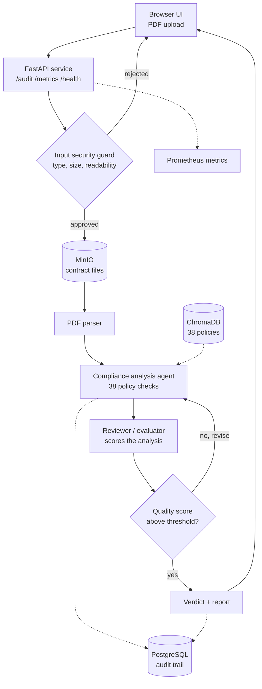

# Data Processing Contract Auditor
### Capstone Project for the Advanced Agentic AI Systems Engineering (AAASE) Program

An AI agent that reviews data-processing contracts against an SDAIA-derived regulatory policy baseline, then produces traceable compliance findings with evidence, risk level, recommendations, and human-review routing.

> **Disclaimer:** This project supports contract review and does not replace professional legal or privacy assessment.

---

## Team

| Member | GitHub | LinkedIn |
|---|---|---|
| **[Muneera AlSaeed]** | [@mneerh](https://github.com/mneerh) | [LinkedIn](https://www.linkedin.com/in/username/) |
| **[Shaikha AlKhathlan]** | [@shiakah27](https://github.com/shiakah27) | [LinkedIn](https://www.linkedin.com/in/username/) |

---

## Problem Statement

Organizations that work with external vendors often need to review data-processing agreements, cloud contracts, data-sharing agreements, and other contracts that involve personal data.

This review is usually:

- Time-consuming and repetitive.
- Dependent on manual legal or privacy review.
- Difficult to standardize across different reviewers.
- Prone to missing unclear, absent, or high-risk clauses.
- More complex when a company has internal requirements in addition to the regulatory baseline.

We chose this problem because data-processing contracts contain recurring privacy requirements that can be represented as structured policies and checked through an evidence-based agent workflow.

---

## How the Agent Solves It

### Input

- A contract file (PDF), uploaded through the web interface or the API.
- A regulatory policy set derived from official SDAIA sources (38 active policies).

Supported contract types in the policy dataset:

- Data Processing Agreements
- Cloud Service Agreements
- Data Sharing Agreements
- Cross-Border Data Transfer Agreements
- Employee Data Vendor Agreements
- Marketing Data Processing Agreements

### Agent Workflow

1. **Validate the uploaded file**
   - Checks file type, size, and readability before any LLM call is made, so invalid input costs nothing.

2. **Store the contract**
   - Writes the original file to MinIO object storage under the run ID.

3. **Extract contract text**
   - Parses the PDF and passes the full text into the workflow state.

4. **Evaluate against every policy**
   - For each of the 38 policies, the agent is given the policy requirement, its acceptable-clause examples, its non-compliance indicators, its ambiguity indicators, and its human-review triggers, then classifies the contract as:
     - `compliant`
     - `non_compliant`
     - `missing`
     - `ambiguous`
     - `not_applicable`
   - Every evaluation is written to the audit trail with its own latency and cost.

5. **Review the findings**
   - A reviewer agent scores the overall quality of the analysis.

6. **Revise if needed**
   - If the score falls below the threshold, the graph routes back to the analysis agent with the reviewer's feedback. Capped at two revisions so the loop always terminates.

7. **Generate the final result**
   - Produces an overall compliance score, a verdict with written justification, per-policy findings, and a saved report file.

### Agentic Behavior

- **State:** contract text, findings, quality score, revision count, token usage, and cost are stored in a shared LangGraph state.
- **Conditional routing:** the graph chooses between generating the report and re-running the analysis, based on the reviewer's score and the revision cap.
- **Multiple roles:** parsing, compliance analysis, and review are separate nodes with separate responsibilities.
- **Revision loop:** low-quality analysis is sent back for another attempt rather than reported as-is.
- **Human-in-the-loop routing:** ambiguous and critical findings are flagged for specialist review and can never be auto-approved.

### Verdict Rules

| Verdict | Condition |
|---|---|
| **Approved** | Every policy compliant or not applicable, no critical risk, nothing flagged for review |
| **Human Review Required** | No outright failures, but ambiguous clauses or critical risk present |
| **Not Approved** | Any non-compliant or missing policy |

Critical risk can never reach "Approved", regardless of every other result.

### Output Example

```json
{
  "policy_id": "DATA-012",
  "status": "non_compliant",
  "risk_level": "critical",
  "contract_evidence": "Personal Data may be retained indefinitely and in perpetuity.",
  "reason": "The clause permits retention with no defined limit or deletion trigger.",
  "recommendation": "Define a retention period or objective retention criteria per purpose.",
  "human_review_required": true,
  "confidence": 0.91,
  "source_reference": "Saudi PDPL -- Article 18, 31"
}
```

---

## Architecture



Solid arrows are the request path. Dashed arrows are reads and writes to
storage and monitoring. The loop from the quality gate back to the analysis
agent is the revision cycle, capped at two attempts.

### Main Components

| Layer | Components |
|---|---|
| Interface | Browser UI with drag-and-drop upload, compliance ring, expandable findings, print report |
| API | FastAPI service: `POST /audit`, `GET /metrics`, `GET /health` |
| Security | Input guard on file type, size, and readability, applied before any model call |
| Orchestration | LangGraph state graph with a conditional revision edge |
| Policy store | ChromaDB holding the 38 SDAIA-derived policy definitions |
| Object storage | MinIO (S3-compatible) for uploaded contract files |
| Persistence | PostgreSQL append-only audit trail, one row per policy evaluation |
| Monitoring | Structured JSON logs keyed by `run_id`, plus Prometheus metrics |

---

## Tech Stack

| Area | Technology | Why We Chose It |
|---|---|---|
| Orchestration | LangGraph | State graph with conditional edges, so the reviewer can send weak analysis back for another attempt |
| LLM access | OpenRouter | One API across many models; switching models is a single environment variable |
| Vector store | ChromaDB | Local and dependency-light; holds the policy definitions |
| Object storage | MinIO | S3-compatible, so the same code would run against real cloud storage |
| Database | PostgreSQL | Durable, queryable audit trail that survives container restarts |
| API framework | FastAPI | Async file uploads, request validation, minimal boilerplate |
| Monitoring | prometheus-client | Standard metrics format any ops dashboard can scrape |
| PDF parsing | pypdf | Lightweight, pure Python, no system dependencies |
| Deployment | Docker Compose | Runs the app, database, and object storage together with one command |

---

## Project Structure

```
AAASE-CAPSTONE/
├── capstone_contract_audit_v2.py               # agent, API, and UI
├── sdaia_pdpl_contract_audit_policies_v1.json  # 38 policy definitions
├── make_test_contracts.py                      # generates the test PDFs
├── contract_approved.pdf                       # test: expects "Approved"
├── contract_human_review.pdf                   # test: expects "Human Review Required"
├── contract_rejected.pdf                       # test: expects "Not Approved"
├── Dockerfile
├── docker-compose.yml                          # app + PostgreSQL + MinIO
├── requirements.txt
├── .env.example                                # template -- copy to .env
└── .gitignore
```

---

## How to Run

### Prerequisites

Docker Desktop installed and running.

### 1. Configure

```bash
cp .env.example .env
```

Add an OpenRouter API key to `.env`. To run fully offline with no key, leave `MOCK=1` set in `docker-compose.yml`.

### 2. Start the stack

```bash
docker compose up --build
```

This starts three containers: the app, PostgreSQL, and MinIO.

### 3. Open the interface

```
http://localhost:8080
```

Upload one of the included test contracts and run the audit.

### Other endpoints

```bash
curl localhost:8080/health
curl localhost:8080/metrics
curl -X POST localhost:8080/audit -F "file=@contract_rejected.pdf"
```

MinIO console: `http://localhost:9001` (`minioadmin` / `minioadmin`)

---

## Demonstration Evidence

### Example Input

Three test contracts are included, generated directly from the policy dataset's own labelled clause examples so each produces a known, verifiable outcome:

| File | Expected verdict | How it was built |
|---|---|---|
| `contract_approved.pdf` | Approved | Every policy addressed using its `acceptable_clause_examples` |
| `contract_human_review.pdf` | Human Review Required | 8 policies use their `ambiguity_indicators` |
| `contract_rejected.pdf` | Not Approved | 22 policies use their `non_compliance_indicators` |

Regenerate them with:

```bash
python make_test_contracts.py
```

### Example Result

Running `contract_rejected.pdf` returns:

```json
{
  "verdict": "Not Approved",
  "justification": "Approval requires every policy to be compliant with no critical-risk findings. 16 finding(s) marked 'non_compliant'. 5 finding(s) at CRITICAL risk -- critical risk can never be approved.",
  "policies_checked": 38,
  "critical_risk": 5,
  "human_review_required": 13
}
```

### Screenshots

_Add screenshots of the three verdicts here._

---

## Design Notes

- The audit trail is append-only: rows are only ever inserted, never updated or deleted, so the compliance record stays defensible.
- Vendor contract text is never written into the shared vector store. Only the company's own policies live there, keeping tenant data isolated.
- Uploaded files are deleted from local disk immediately after processing.
- Every policy is checked on every run rather than retrieving only the "most relevant" ones. For compliance auditing, missing a violation because a similarity search ranked it low is a worse failure than the extra cost of checking everything.
- `MOCK=1` uses an offline stand-in model so the project runs with no API key. It approximates the model's judgement by comparing the contract against each policy's labelled example sets, and is deliberately cruder than a real model call. Use `MOCK=0` with an API key for accurate results.

---

## Policy Dataset

`sdaia_pdpl_contract_audit_policies_v1.json` contains 38 active contract controls derived from the Saudi Personal Data Protection Law, issued by SDAIA.

**These are operational controls, not legal opinions.** The dataset is marked `pending_legal_review` and must be validated by a qualified legal or privacy specialist before any real-world use.

---

## Reference

https://github.com/SDAIAAcademy

## Acknowledgment

Special thanks to SDAIA Academy for this opportunity, and to our instructor, Ibrahim Al-Shehri, for his guidance and support throughout the program.

---
