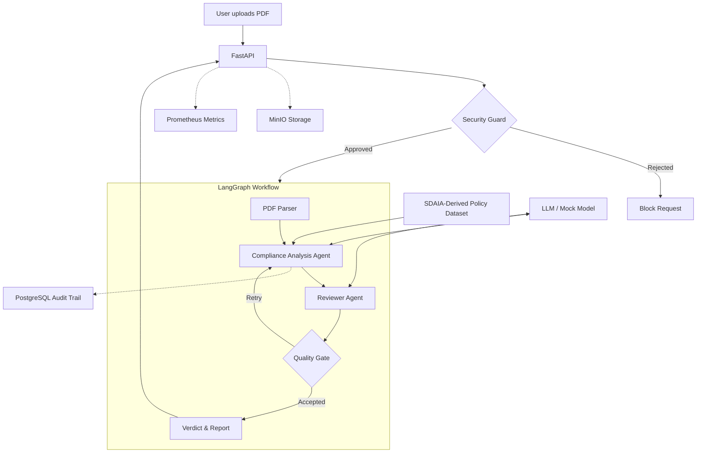
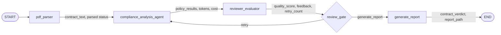

# Data Processing Contract Auditor 
### Capstone Project for the Advanced Agentic AI Systems Engineering (AAASE) Program

An AI agent that reviews data-processing contracts against an initial SDAIA-derived regulatory policy baseline and optional company-specific policies, then produces traceable compliance findings with evidence, risk level, recommendations, and human-review routing.

> **Disclaimer:** This project supports contract review and does not replace professional legal or privacy assessment.

---

## Team

| Member | GitHub | LinkedIn |
|---|---|---|
| **[Muneera AlSaeed]** | [@mneerh](https://github.com/mneerh) | [LinkedIn](https://www.linkedin.com/in/username/) |
| **[Shaikha AlKhathlan]** | [@shiakah27](https://github.com/shiakah27) | [LinkedIn](https://www.linkedin.com/in/username/) |

---


## Problem Statement

Organizations that exchange personal data with vendors must review agreements such as data-processing, cloud-service, data-sharing, employee-data, marketing-data, and cross-border transfer contracts.

Manual review is often:

- Slow and repetitive.
- Difficult to standardize across reviewers.
- Vulnerable to missing absent, ambiguous, or high-risk clauses.
- Hard to trace back to the relevant policy requirement.
- More complex when a company adds internal requirements on top of a regulatory baseline.

We chose this problem because data-processing contracts contain recurring controls that can be represented as structured policies and evaluated through a stateful, reviewable workflow.

---

## What the Current System Does

### Input

- One PDF contract.
- A structured policy dataset derived from the Saudi Personal Data Protection Law.
- Runtime configuration such as mock/real model mode, review threshold, retry limit, PostgreSQL connection, and optional MinIO storage.

### Processing

1. FastAPI receives the uploaded PDF.
2. A pre-graph input guard checks that the file exists, has a `.pdf` extension, and is no larger than 20 MB.
3. The contract is optionally copied to MinIO.
4. LangGraph starts a shared `AuditState`.
5. `pdf_parser` extracts the full PDF text with `pypdf`.
6. `compliance_analysis_agent` evaluates the full contract against every active policy.
7. Each policy result is appended to PostgreSQL with latency and estimated cost.
8. `reviewer_evaluator` scores the overall analysis quality and returns feedback.
9. `review_gate` either:
   - routes back to the analysis agent for revision, or
   - continues to report generation.
10. `generate_report` calculates the final verdict and writes a local JSON report.
11. FastAPI returns the final graph state to the browser/API caller.

### Per-policy classifications

- `compliant`
- `non_compliant`
- `missing`
- `ambiguous`
- `not_applicable`

Each finding may include:

- Policy ID and policy name.
- Contract evidence.
- Risk level.
- Reason.
- Recommendation.
- Confidence.
- Source article reference.
- `human_review_required`.

---

## Agentic Behavior

The implementation is agentic because it uses:

- **Shared state:** contract text, policy findings, reviewer feedback, quality score, retry count, token usage, cost, verdict, and report path move through the graph.
- **Specialized roles:** policy analysis and quality review use separate prompts and responsibilities.
- **Conditional routing:** the quality gate decides whether to revise or finish.
- **Revision loop:** reviewer feedback is injected into the next analysis attempt.
- **Bounded execution:** the retry loop is capped by `MAX_RETRIES`.
- **Traceability:** structured logs and per-policy PostgreSQL entries are linked by `run_id`.

> The current code **flags** findings that need a privacy specialist. It does not yet pause execution for a real human approval/resume step.

---

## Verdict Rules

The backend uses three verdicts:

| Verdict | Current code rule |
|---|---|
| **Not Approved** | At least one policy is `non_compliant` or `missing`. |
| **Human Review Required** | No hard failure exists, but at least one finding is `ambiguous`, `critical`, or marked `human_review_required`. |
| **Approved** | All findings are compliant or not applicable, with no critical risk and no specialist-review flag. |

The backend currently returns a verdict and justification. It does **not** calculate a compliance percentage.

---

## System Architecture — Current Implementation

## System Architecture



### Important architecture clarification

The repository imports ChromaDB and defines `get_policy_store()`, but the current `run_audit()` path and LangGraph nodes do not call it. The active analysis path loads the policy JSON directly and checks **all 38 policies**. ChromaDB is therefore not shown as an active runtime dependency in the diagram above.

---

## LangGraph Node Architecture



### Node responsibilities

| Component | Type | Reads | Writes / side effects |
|---|---|---|---|
| `pdf_parser` | LangGraph node | `contract_file`, `run_id` | Extracts `contract_text`; sets status to `parsed`. |
| `compliance_analysis_agent` | LangGraph agent node | Contract text, all active policies, optional reviewer feedback | Produces `policy_results`; updates token/cost totals; inserts one PostgreSQL audit row per policy. |
| `reviewer_evaluator` | LangGraph reviewer node | Policy-result summary | Produces `quality_score`, `review_feedback`, and increments `retry_count`. |
| `review_gate` | Conditional routing function | Quality score and retry count | Returns either `retry` or `generate_report`. |
| `generate_report` | LangGraph deterministic node | Policy results and accumulated state | Calculates verdict; writes `reports/<run_id>.json`; stores `contract_verdict` and `report_path`. |
| `input_security_guard` | Pre-graph function | Uploaded file path | Accepts/rejects the request before graph execution. |
| `store_contract_in_minio` | Pre-graph service | File path and run ID | Optionally stores the original PDF in the `contracts` bucket. |

---

## Shared State

`AuditState` currently contains:

| Field | Purpose |
|---|---|
| `run_id` | Correlates logs, database rows, report, and API response. |
| `contract_file` | Temporary/local path of the uploaded PDF. |
| `contract_text` | Full text extracted from the PDF. |
| `policy_results` | Per-policy compliance findings. |
| `contract_verdict` | Final verdict, justification, and policy ID lists. |
| `report_path` | Path of the generated local JSON report. |
| `quality_score` | Reviewer score used by the conditional gate. |
| `review_feedback` | Reviewer guidance passed into a retry. |
| `retry_count` | Number of reviewer passes; controls loop termination. |
| `tokens_in` / `tokens_out` | Accumulated model usage. |
| `cost_usd` | Estimated model cost using project constants. |
| `status` | Current processing status. |

Default workflow settings:

```text
QUALITY_THRESHOLD = 7
MAX_RETRIES = 2
```

This allows the initial analysis plus at most two revisions.

---

## Policy Dataset

The repository includes:

```text
sdaia_pdpl_contract_audit_policies_v1.json
```

sdaia_pdpl_contract_audit_policies_v1.json contains 38 active contract controls derived from the Saudi Personal Data Protection Law, issued by SDAIA.

These are operational controls, not legal opinions. The dataset is marked pending_legal_review and must be validated by a qualified legal or privacy specialist before any real-world use.

---


## Tech Stack

| Area | Technology | Current role |
|---|---|---|
| Language | Python 3.11 | Application, graph, API, storage, and report logic. |
| Agent orchestration | LangGraph | Stateful nodes, conditional route, and bounded revision loop. |
| Model interface | `langchain-openai` | OpenRouter-compatible `ChatOpenAI` client. |
| API and UI | FastAPI + embedded HTML/CSS/JS | PDF upload, audit result, health, metrics, and audit-trail endpoints. |
| PDF extraction | `pypdf` | Extracts text from text-based PDFs. |
| Policy source | JSON | Active source for all 38 policy checks. |
| Vector store | ChromaDB | Dependency/helper exists, but is not invoked by the current audit flow. |
| Object storage | MinIO | Optional S3-compatible storage for uploaded contracts. |
| Audit database | PostgreSQL + `psycopg2` | Append-only-by-application audit entries. |
| Monitoring | Prometheus client | Audit, block, retry, latency, and cost metrics. |
| Logging | Python logging + JSON | Structured events correlated by `run_id`. |
| Deployment | Docker + Docker Compose | App, PostgreSQL, and MinIO containers. |

---

## Repository Structure

The current repository contains:

---

## How to Run

### Prerequisites

- Git
- Docker Desktop with Docker Compose

### 1. Clone the repository

```bash
git clone https://github.com/mneerh/AAASE-CAPSTONE.git
cd AAASE-CAPSTONE
```

### 2. Align the policy filename expected by the current code

The current Python default and Dockerfile expect a file named `policies.json`, while the committed dataset has a longer filename.

Create the expected copy:

```bash
cp sdaia_pdpl_contract_audit_policies_v1.json policies.json
```

### 3. Create the environment file

```bash
cp .env.example .env
```

Docker Compose currently starts the application in offline mode with `MOCK=1`, so an OpenRouter key is not required for the default demonstration.

### 4. Start the stack

```bash
docker compose up --build
```

This starts:

- Application: `http://localhost:8080`
- PostgreSQL: `localhost:5432`
- MinIO S3 API: `http://localhost:9000`
- MinIO console: `http://localhost:9001`

Default MinIO credentials:

```text
Username: minioadmin
Password: minioadmin
```

### 5. Open the web interface

```text
http://localhost:8080
```

Upload a text-based PDF contract and run the audit.

---

## Observability

### Structured logs

Every event is emitted as JSON and includes:

```text
timestamp
run_id
event
event-specific fields
```

Examples include:

- request received,
- input blocked,
- graph-node entry,
- policy checked,
- review verdict,
- contract verdict,
- report written,
- final response.

### Prometheus metrics

| Metric | Meaning |
|---|---|
| `audits_total` | Audit requests received. |
| `audits_blocked_total` | Requests rejected by the input guard. |
| `audits_retried_total` | Reviewer routes back to analysis. |
| `audit_latency_seconds` | End-to-end audit duration. |
| `audit_cost_usd_total` | Accumulated estimated model cost. |

---

## Demonstration Evidence

### Rendered result interface

The image below shows the human-readable result interface using demonstration data:

### Approved


### Human Review Required


### Not Approved


### Per-policy output shape

```json
{
  "policy_id": "DATA-012",
  "policy_name": "Defined Retention Period",
  "status": "non_compliant",
  "risk_level": "critical",
  "contract_evidence": "Personal Data may be retained indefinitely and in perpetuity.",
  "reason": "The clause permits retention with no defined limit or deletion trigger.",
  "recommendation": "Define a retention period or objective retention criteria per purpose.",
  "human_review_required": true,
  "confidence": 0.91,
  "source_reference": "Saudi PDPL -- Article 18, 31"
}
```


---

## Reference

- [SDAIA Academy GitHub](https://github.com/SDAIAAcademy)

## Acknowledgment

Special thanks to **SDAIA Academy** for this opportunity, and to our instructor, **Ibrahim Al-Shehri**, for his guidance and support throughout the program.
